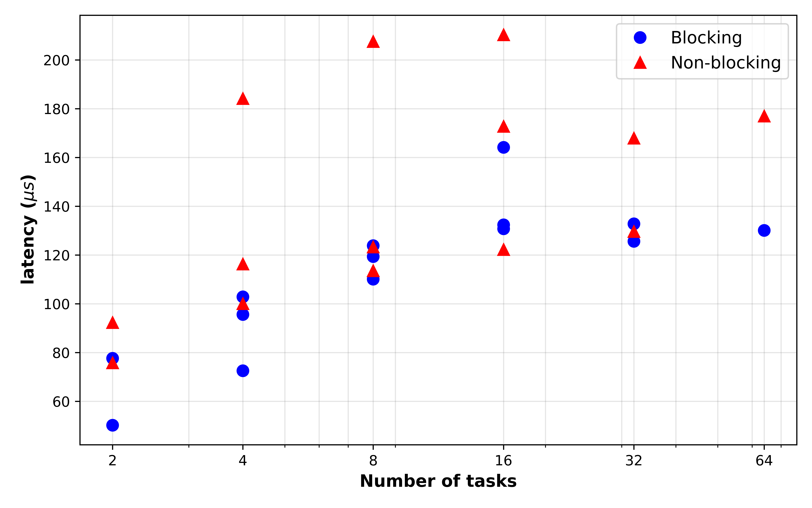
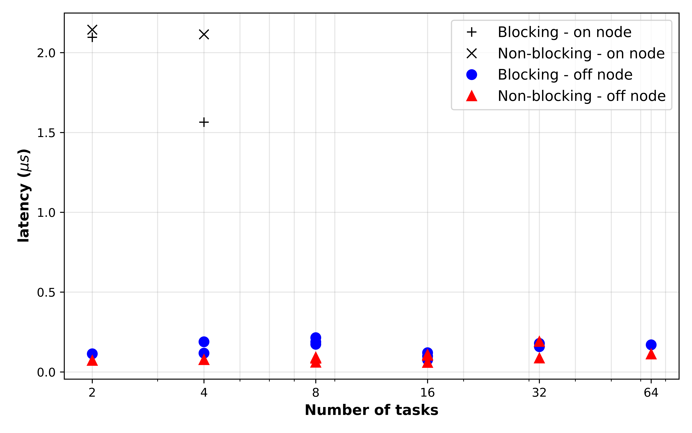

# Project 3: MPI Ping-Pong and Ring Shift

## Part 1: Ping-Pong test

In the first part of the project, we implemented the Ping-Pong test using both blocking and non-blocking communication. In this regard, the following points are noted:

* For the blocking scheme, the `MPI_Send()` and `MPI_Recv()` functions were used, while for the `MPI_Isend()` and `MPI_Irecv()` used for the non-blocking scheme. 

* The C++ codes can be found under './src' directory, titled: `PingPongBlocking.cpp` and `PingPongNonBlocking.cpp`. In these codes, the message size, number of iterations, and the path to the result csv are inputs.

* The runtime for one complete communication between two ranks were timed using the `MPI_Wtime()` function. 

* 100 ping-pong iteration was used to overcome the noise effect on the timing data. Still, the middle 80 datapoints used for averaging the communication time. 

* A wide range of message sizes were used for this project from 2 bytes to 16 MB. This way, we made sure to collect data for evaluating both latency and bandwidth of the model.

* Both blocking and non-blocking ping-pong test models were run on either same node (on node) and different nodes (off nodes). This process was controlled by `SLURM`. 

    * A constraint of using similar nodes has been used in job file to make sure all runs using similar resources: `#SBATCH --constraint=amr`

    * For the on node analysis, only one node and 2 task per each node was requested, while for the off node analysis, two nodes and one task per node was used.

* During the Ping-Pong process, for a given message size `s`, the amount of data transfering between the first and second processess is $2 \times s$, reason being that the data is send by the first process to the second one, and then the send by the second and recieved by first. But, the timing is for the whole back-forth set. This ponit has been implemented in the calculation of the bandwidth.

The Blocking and Non-blocking ping-pong has been run on HPCC `amr` type of nodes using both single node (on node) and two different physical nodes (off nodes). The average communication time as a function of the message size has been shown below:

As shown in the above figure, the curve for the "off node" results were significantly higher that that of "on node" with a vertical shift. This clearly verifies the application of the off node communication where the messages should travel furhter distances between the actual physical nodes the processess located. 

In more technical ponit of view, this figure shows that the communication run time of the ping-pong test was somehow stabilized up to a certain message size, which can be used to calculate the _latency_. However, after that point, the slope of curve can be used for calculation of the _bandwidth_. In this regard, a linear model has been used to fit to the data as follows:

$T = \alpha + \beta \times x$

where $T$ is the runtime communication, $x$ is the message size (bytes), $\alpha$ is the latency (s), and $\beta$ is used for calculation of the bandwidth using the following equation:

$B = \frac{2}{\beta} \times 10^{-9}$

where $B$ is the bandwidth (GB/s), and we have $2$ at the numinator as the communication time is corresponds to $2 \times s$. 

The _latency_ and _bandwidth_ results from the previous figure has been summarized in the following table. As this table shows, the _latency_ of the system on the `amr` nodes were about $2.36 \mu s$. On the other hand, the _latency_ of the system when two processess were located on two different physical nodes were found to be abount $35.7 \mu s$, which was about 15 times higher than the situation where two processess are located on the same node. 

Senario | _Latency_ ($\mu s$) | _Bandwidth_ ($GB/s$)
--|--|--
On node / Blocking    | 2.47   | 0.99
Off node/ Blocking    | 34.11  | 1.04
On node / NonBlocking | 2.25   | 0.99
Off node/ NonBlocking | 37.42  | 1.04

Moreover, the results showed that the _bandwidth_ for all scenarios (includeing on/off nodes and blocking/nonblocking) were almost similar and about $1 GB/s$. Considering implementation of the high-speed network in HPCC and similar facilities, the _bandwidth_ results verified this fact, where the _bandwidth_ of the on/off node runs were almost identical. However, it should be mentioned that the _bandwidth_ is an indicator of the rate of data transfer, while for ping-pong runs on off nodes, although high _bandwidth_ available through the high speed networks, the runtimes still higher because of the physical distances and communications needed. 

## Part 2: Ring Shift test

In the second part of the project, we implemented the Ring Shift test using both blocking and non-blocking communication. In this regard, the following points are noted:

* For the blocking scheme, the `MPI_Sendrecv()` function was used, while for the `MPI_Isend()` and `MPI_Irecv()` functions used for the non-blocking scheme. 

* The C++ codes can be found under './src' directory, titled: `RingBlocking.cpp` and `RingNonBlocking.cpp`. In these codes, the message size, number of iterations, and the path to the result csv are inputs.

* The runtime for one complete communication was timed by each rank. This complete communication means to send a message for the next rank in the ring and recieve the message from the previous rank in the ring. Then, each rank calculates the runtime of its complete comminucation and then a `MPI_Reduce` function is used to average the runtimes over all ranks. This average value was then used in the analysis. 

* 100 Ring Shift iteration was used to overcome the noise effect on the timing data. Still, the middle 80 datapoints used for averaging the communication time. 

* A wide range of message sizes were used for this project from 2 bytes to 16 MB. This way, we made sure to collect data for evaluating both latency and bandwidth of the model.

* Both blocking and non-blocking Ring Shift test models were run on either same node (on node) and different nodes (off nodes). This process was controlled by `SLURM`. 

    * A constraint of using similar nodes has been used in job file to make sure all runs using similar resources: `#SBATCH --constraint=amr`

    * The following shows different combinations used for ring shift:

| Num Nodes | Num Tasks per Node | Total number of Tasks | 
|--|--|--|
| 1 | 2, 4, 8, 16, 32, 64, 128 | 2, 4, 8, 16, 32, 64, 128 |
| 2 | 1, 2, 4, 8, 16, 32, 64 | 2, 4, 8, 16, 32, 64, 128 |
| 4 | 1, 2, 4, 8, 16, 32 | 4, 8, 16, 32, 64, 128 |
| 8 | 1, 2, 4, 8, 16 | 8, 16, 32, 64, 128 |
| 16| 1, 2, 4, 8 | 16, 32, 64, 128 |

* During the Ring shift process, for a given message size `s`, the amount of data transfering for a complete comminucation is $2 \times s$, reason being that the data is send to the next rank in the ring, and then recieved from the previous rank in the ring; but, the timing is for the whole complete comminucation set. This ponit has been implemented in the calculation of the bandwidth.

The Blocking and Non-blocking Ring Shift has been run on HPCC `amr` type of nodes using all combinations of the number of nodes and tanks, as defined in the previous table. The average communication time as a function of the message size has been shown below:

As shown in the above figure, the message sizes of less than 500KB clearly shows the system _latency_ while bigger message sizes can be used to calculate the system's _bandwidth_. For this purpose, the linear model as shown in Part 1, was fitted to the data for calculation of the _latency_ and _bandwidth_. It is noted that the second portion the curve (last 6 data points) were used for more accurate calculation of the system _bandwidth_. The results are presented in the following table:

| # nodes | # tasks | # task/node | Block - _latency_ ($\mu s$) | Block - _bandwidth ($GB/s$) | NonBlock - _latency_ ($\mu s$) | NonBlock - _bandwidth_ ($GB/s$) |
|---|---|---|---|---|---|---|
| 1 (on node) | 2 | 2 | 50.2 | 2.09 | 75.8 | 2.14 |
| 1 (on node) | 4 | 4 | 72.6 | 1.56 | 116.3 | 2.11 |
| 2 | 2 | 1 | 77.6 | 0.11 | 92.2 | 0.07 |
| 2 | 4 | 2 | 95.6 | 0.12 | 100.0 | 0.08 |
| 2 | 8 | 4 | 123.8 | 0.21 | 113.5 | 0.06 |
| 4 | 4 | 1 | 102.9 | 0.19 | 184.2 | 0.08 |
| 4 | 8 | 2 | 110.1 | 0.17 | 207.5 | 0.09 |
| 4 | 16 | 4 | 164.2 | 0.12 | 210.3 | 0.06 |
| 8 | 8 | 1 | 119.4 | 0.19 | 123.3 | 0.09 |
| 8 | 16 | 2 | 132.4 | 0.08 | 122.2 | 0.10 |
| 8 | 32 | 4 | 125.6 | 0.16 | 129.7 | 0.09 |
| 16 | 16 | 1 | 130.8 | 0.10 | 172.8 | 0.11 |
| 16 | 32 | 2 | 132.8 | 0.18 | 167.9 | 0.19 |
| 16 | 64 | 4 | 130.1 | 0.17 | 177.0 | 0.11 |

As this table shows, the _latency_ of the on node ring shift were significantly lower than those of the off node ring shift, where the average on node _latency_ was $78.7 \mu s$, while the average off node _latency_ was $135.26 \mu s$. Such a finding make sense as off node calculations required more time for completing the comminucations. Also, it has been observed that the latency of the system increases with the increase in the number of tasks, which is shown in the figure below. This observation also justified as more tasks (bigger ring) required more overhead time to set up and transfer the message. 

 .

In terms of the _bandwidth_, the results showed that the on node calculations had significantly higher _bandwidth_ compared with those run off node. More specifically, the average _bandwidth_ of the On node Ring shift test was about $1.98 GB/s$, while the _bandwidth_ of the off node ring shift test was about $0.12 GB/s$.

The _bandwidth_ results as a function of the tasks has been plotted as below. This figure highlighted the previous discussion about the significantly lower _bandwidth_ of the off node calculations in the ring shift test. This results can be justified given the fact that in the on node calculations, the processes access the memory locations that are avialable on the same nodes using the high speed on node connections, while for the off node calculations, one processor might need to access a memory location that is located on different node. Such access should be made through the network and therefore, the lower _bandwidth_ was calculated as the results.

